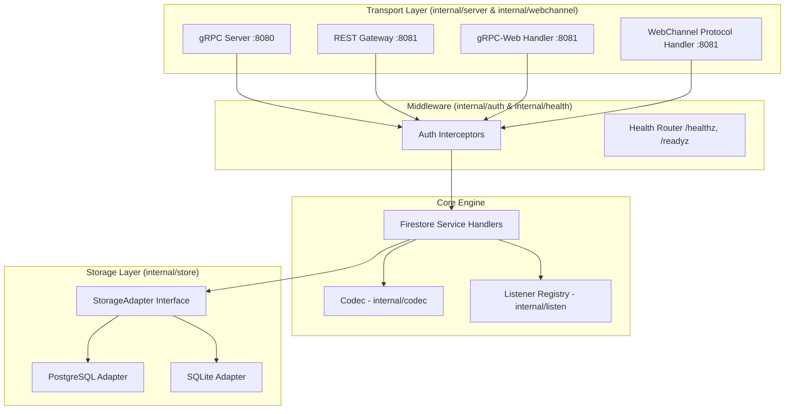
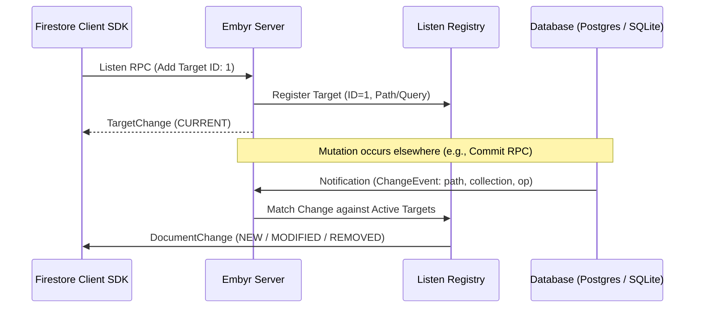

# Embyr — System Architecture & Internal Design

This document details the internal architecture, component design, data storage models, and request lifecycles of **Embyr**.

---

## 🏛️ High-Level Component Overview

Embyr is structured into modular Go packages under `internal/`, separating protocol handling, storage abstraction, translation, and real-time subscription state.



### Package Responsibilities

| Package | Path | Primary Responsibility |
| :--- | :--- | :--- |
| **`server`** | [internal/server](file:///Users/petervyboch/Projects/embyr/internal/server) | Multi-transport HTTP/gRPC listener management, gRPC service methods (`GetDocument`, `Commit`, `Listen`, etc.), custom JSON streaming handlers. |
| **`webchannel`** | [internal/webchannel](file:///Users/petervyboch/Projects/embyr/internal/webchannel) | Implementation of Google WebChannel / BrowserChannel protocol (long-polling forward & back channels for browser clients). |
| **`store`** | [internal/store](file:///Users/petervyboch/Projects/embyr/internal/store) | Storage abstraction interface (`StorageAdapter`), document metadata models, and concrete PostgreSQL & SQLite drivers. |
| **`codec`** | [internal/codec](file:///Users/petervyboch/Projects/embyr/internal/codec) | Bidirectional conversion between Google Firestore Protobuf messages (`Value`, `Document`, `StructuredQuery`) and SQL/JSON representations. |
| **`listen`** | [internal/listen](file:///Users/petervyboch/Projects/embyr/internal/listen) | Stream registry for active real-time `Listen` watch targets, mapping target IDs to client streaming channels. |
| **`auth`** | [internal/auth](file:///Users/petervyboch/Projects/embyr/internal/auth) | gRPC unary and stream interceptors for authentication modes (`none`, `key`, `google`, `mtls`). |
| **`config`** | [internal/config](file:///Users/petervyboch/Projects/embyr/internal/config) | Viper-backed configuration loading, default definitions, and runtime validation. |

---

## 💾 Storage Layer & Data Model

Embyr stores Firestore documents inside relational database tables (`documents`). The storage layer is accessed through the `store.StorageAdapter` Go interface.

### `store.StorageAdapter` Interface

```go
type StorageAdapter interface {
    GetDocument(ctx context.Context, path string) (*Document, error)
    BatchGetDocuments(ctx context.Context, paths []string) ([]*Document, error)
    PutDocument(ctx context.Context, doc *Document, expectedVersion *int64) error
    DeleteDocument(ctx context.Context, path string, expectedVersion *int64) error
    QueryDocuments(ctx context.Context, req *QueryRequest) (*QueryResultPage, error)
    BeginTransaction(ctx context.Context) (string, error)
    CommitTransaction(ctx context.Context, txID string, mutations []*Mutation) error
    RollbackTransaction(ctx context.Context, txID string) error
    Migrate(ctx context.Context) error
    Subscribe(ctx context.Context) (<-chan ChangeEvent, error)
    Close() error
}
```

### Relational Database Table Schema

Both PostgreSQL and SQLite maintain an identical document storage layout:

| Column | SQL Type | Description |
| :--- | :--- | :--- |
| `path` | `TEXT PRIMARY KEY` | Full document resource name (e.g. `projects/p/databases/(default)/documents/users/user1`). |
| `collection` | `TEXT NOT NULL` | Trailing collection name extracted from path (e.g. `users`). |
| `parent` | `TEXT NOT NULL` | Parent document path or parent document sub-collection root. |
| `data` | `JSONB` / `TEXT` | Serialized JSON containing document fields (`{"fields":{...}}`). |
| `created_at` | `TIMESTAMPTZ` | RFC3339 timestamp of initial document creation. |
| `updated_at` | `TIMESTAMPTZ` | RFC3339 timestamp of most recent mutation. |
| `version` | `BIGINT NOT NULL` | Monotonically increasing version counter for Optimistic Concurrency Control (`OCC`). |

---

## ⚡ Real-Time Notification & Watch Streams (`Listen`)

Firestore real-time sync relies on `Listen` streams (`Watch`). Embyr manages active listener connections and broadcasts changes in real time.



### Notification Engines

* **PostgreSQL Engine**: Uses PostgreSQL `LISTEN/NOTIFY` triggers (`000002_notify_trigger.up.sql`). Any write to the `documents` table fires an `AFTER INSERT OR UPDATE OR DELETE` trigger that executes `pg_notify('embyr_doc_changes', json_build_object(...))`.
* **SQLite Engine**: Uses an in-memory Go `chan store.ChangeEvent` hub dispatched on successful mutation execution.

---

## 🔄 Protocol Transports & Multiplexing

Embyr routes requests through two dedicated ports:

### 1. gRPC Port (`:cfg.Server.GRPCPort`, default `:8080`)
Dedicated purely to HTTP/2 gRPC traffic for native server-side Firestore SDKs (Go, Node.js, Python, Java).

### 2. REST & Web Port (`:cfg.Server.RESTPort`, default `:8081`)
Multiplexes multiple web protocols over HTTP/1.1:

```
combinedHandler:
  IsGrpcWebRequest(r) || IsAcceptableGrpcCorsRequest(r) → grpcWebSrv.ServeHTTP
  HasSuffix(path, "/channel")                          → restMux (WebChannel long-poll)
  otherwise                                            → http.TimeoutHandler(restMux, 30s)

restMux:
  GET  /healthz             → 200 "ok"
  GET  /readyz              → 200 if db.Ping ok, 503 otherwise
  POST /…/Listen/channel    → webchannel.Handler (Listen back-channel)
  POST /…/Write/channel     → webchannel.WriteHandler (Write back-channel)
  POST */documents:runQuery → custom JSON-array streamers
  *                         → grpc-gateway runtime mux
```

---

## 🔐 Authentication Architecture

Authentication is executed via gRPC interceptors ([internal/auth](file:///Users/petervyboch/Projects/embyr/internal/auth)):

1. **`none`**: Bypasses check; all requests are allowed.
2. **`key`**: Validates the `authorization: Bearer <key>` header or `x-api-key` header against `cfg.Auth.Key`.
3. **`google`**: Validates Google OAuth2 Access Tokens against Google's tokeninfo endpoint (`https://www.googleapis.com/oauth2/v1/tokeninfo`) and verifies `aud`/`project_id`.
4. **`mtls`**: Demands valid client TLS certificates issued by `cfg.Auth.MTLSCACert`.
